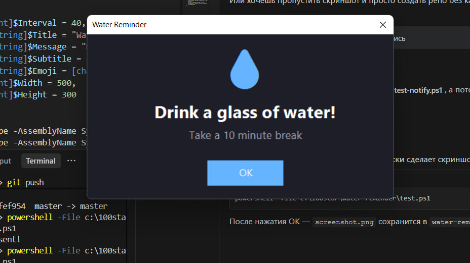

<div align="center">

# 💧 Water Reminder


**Desktop reminder to drink water and take breaks**

</div>

> A zero-dependency PowerShell utility that shows a big, dark-themed popup window at regular intervals. Impossible to miss, easy to dismiss.

<div align="center">



[Quick Start](#-quick-start) · [Features](#-features) · [Parameters](#️-parameters) · [VS Code Integration](#-auto-start-with-vs-code)

</div>

---

## 💡 Concept

Developers forget to hydrate. Small system tray notifications are easy to miss. Water Reminder solves this with a **large, always-on-top popup window** that stays on screen until you press OK. Fully configurable: interval, message, emoji, window size.

---

## ✨ Features

| Feature | Description |
|---------|-------------|
| 💧 Big popup | 500×300 dark-themed window, centered on screen |
| ⏱️ Custom interval | Default 40 min, set any value with `-Interval` |
| 🎨 Dark theme | Easy on the eyes, no bright flash |
| ⚙️ Configurable | Message, title, emoji, subtitle, window size |
| 📌 Always on top | `TopMost` — can't be hidden behind other windows |
| 🔁 Persistent | Loops until you close the terminal or `Ctrl+C` |
| 🚀 Zero dependencies | Built-in PowerShell + .NET, nothing to install |

---

## 🚀 Quick Start

```powershell
git clone https://github.com/maximosovsky/water-reminder.git
cd water-reminder
powershell -File water-reminder.ps1
```

<details>
<summary>Custom interval and message</summary>

```powershell
# Every 30 minutes
powershell -File water-reminder.ps1 -Interval 30

# Custom message
powershell -File water-reminder.ps1 -Message "Stand up and stretch!"

# Full customization
powershell -File water-reminder.ps1 -Interval 25 -Title "Health Break" -Message "Move your body!" -Subtitle "5 minutes of stretching" -Emoji "🏃"
```

</details>

---

## ⚙️ Parameters

| Parameter | Default | Description |
|-----------|---------|-------------|
| `-Interval` | `40` | Minutes between reminders |
| `-Title` | `Water Reminder` | Window title |
| `-Message` | `Drink a glass of water!` | Main message text |
| `-Subtitle` | `Take a 10 minute break` | Secondary text |
| `-Emoji` | 💧 | Emoji displayed in the popup |
| `-Width` | `500` | Window width in pixels |
| `-Height` | `300` | Window height in pixels |

---

## 🏗️ Tech Stack

| Layer | Technology |
|-------|------------|
| Language | PowerShell 5.1+ |
| UI | System.Windows.Forms (.NET) |
| Platform | Windows 10/11 |

```
water-reminder/
├── water-reminder.ps1   # Main script
├── README.md
└── LICENSE
```

---

## 💻 Auto-Start with VS Code

Add to `.vscode/tasks.json` in your workspace:

```json
{
    "version": "2.0.0",
    "tasks": [
        {
            "label": "Water Reminder",
            "type": "shell",
            "command": "powershell -File path/to/water-reminder.ps1",
            "presentation": { "reveal": "silent", "panel": "dedicated" },
            "isBackground": true,
            "problemMatcher": [],
            "runOptions": { "runOn": "folderOpen" }
        }
    ]
}
```

VS Code will ask "Allow automatic tasks?" — click **Allow**.

---

## 🗺️ Roadmap

- [x] Configurable interval, message, emoji
- [x] Dark theme popup window
- [x] VS Code auto-start integration
- [ ] Sound notification option
- [ ] Statistics (glasses per day)
- [ ] VS Code extension version

---

## 🤝 Contributing

Fork → `feature/your-idea` → Pull Request

---

## 📄 License

[Max Osovsky](https://www.linkedin.com/in/osovsky/). Licensed under [MIT](LICENSE).
